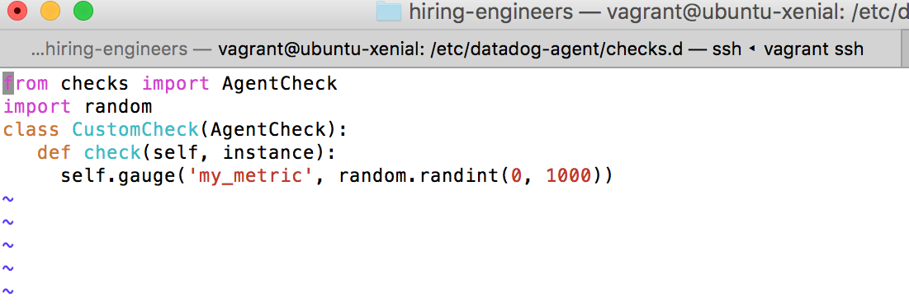
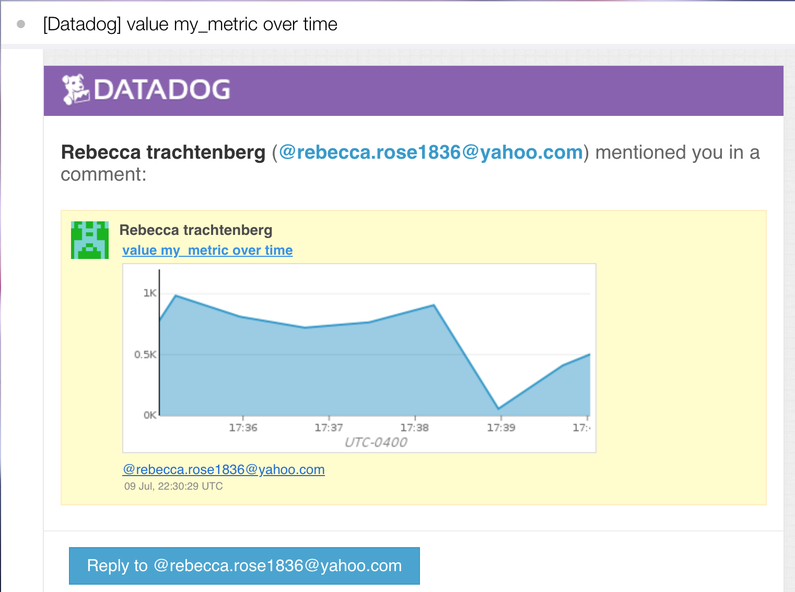
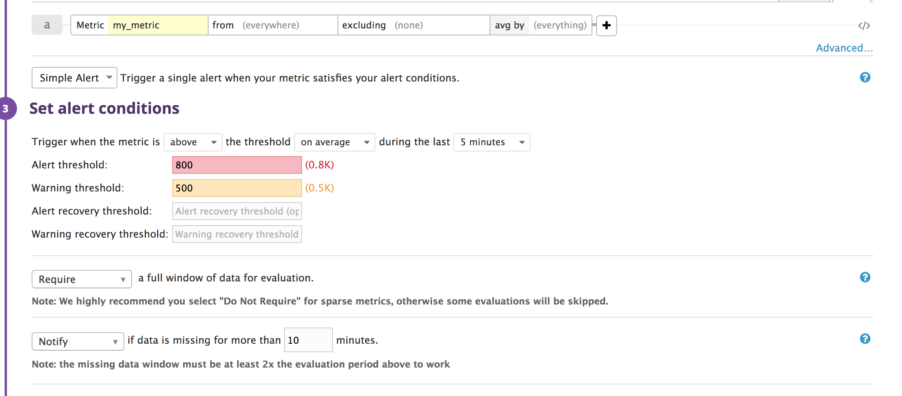
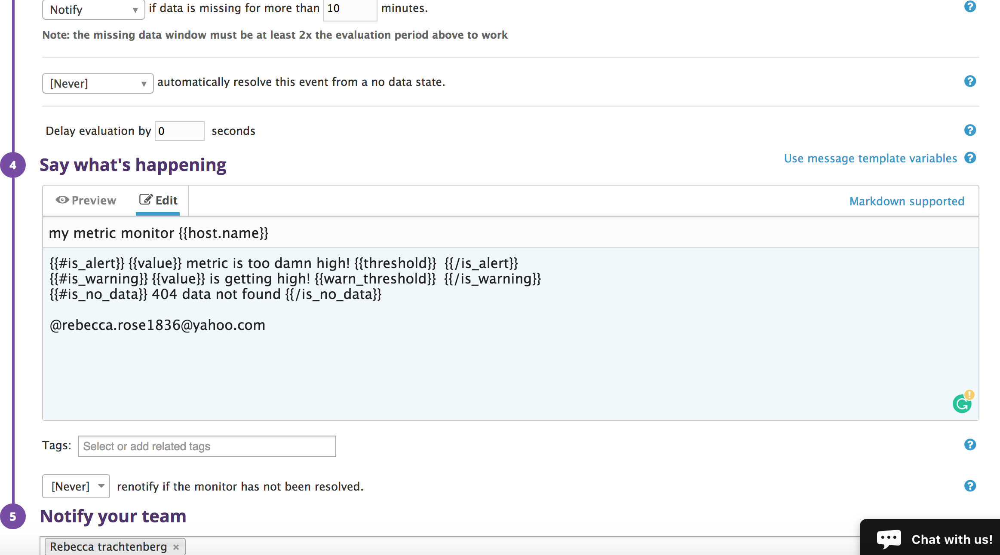
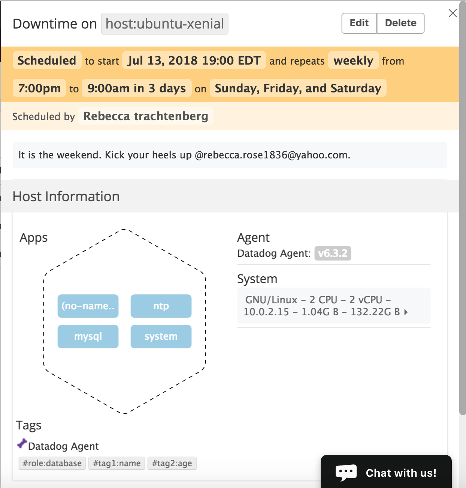
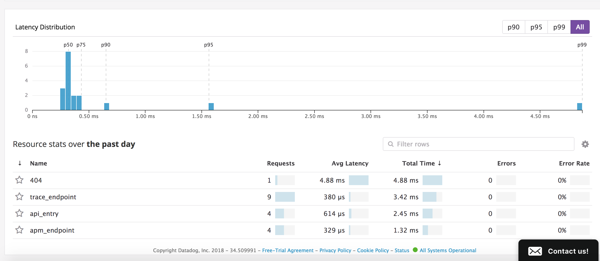
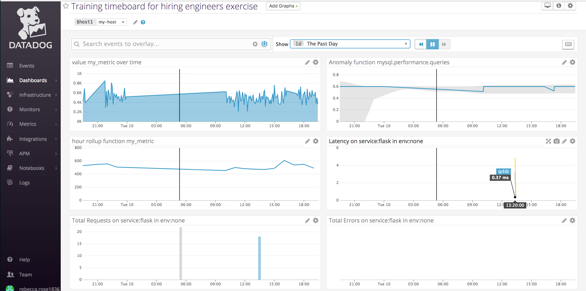

Your answers to the questions go here.

###Prerequisites - Setup the environment

I began by setting up the Ubuntu virtual machine using vagrant. It was relatively straight forward. I followed the instructions here: https://www.vagrantup.com/intro/getting-started/
And set up 16.04 linux version. I then signed up for Datadog for the 14 day free trial.

###Collecting Metrics:
Tags give you a way to distinguish between hosts. 
First we to adapt the Agent configuration file. We can set up datadog by configuring datadog.yaml. Once inside the file you can modify the the tag section.
Here is an example of mine:

You then need to restart you Agent using: sudo service datadog-agent restart

It took me a couple of tries for it to appear on my host map but once it does. This is what is should look like:

Install a database on your VM

I chose MySql.  This link gave me simple instructions on how to install mysql https://support.rackspace.com/how-to/installing-mysql-server-on-ubuntu/

###Create a custom Agent check 
Creating a custom agent check is simple. Inside /etc/datadog-agent/checks.d create a python file. I named mine hello.py. Inside I wrote a python with an output that provides a random number 0 to 1000.

 After that file is created and saved, we need to create a yaml file with the same name as the python file inside /etc/datadog-agent/conf.d folder. 

Once inside the yaml file check’s collection interval needs to be modified so that the metric is only submitted once every 45 second. It should look something like this. 

**Can you change the collection interval without modifying the Python check file you created? **

Yes. You can set a min interval option in the custom metric check. yaml file inside the conf.d directory. The name of the yaml file needs to match the name of your custom agent check python file in the checks.d directory. 
    Ex: conf.d/smile.yaml and checks.d/smile.py

 So really all that needs to be changes is in the yaml file.

### Visualizing Data

After installing Datadog on the VM I created timeboard.py file inside the /etc/datadog-agent folder. 
It should look something like this:

My custom timeboard:

My timeboard over a span of 5 seconds after I emailed myself with the @notation.

**What is the Anomaly graph displaying?**

The Anomaly graph detects data change based on past expressions of the information. It predicts what the normal flow of the data should look look like. The graph is staying constant on the y-axis. Therefore, there are no anomalies being detected.

### Monitoring Data

Data can be monitored from Datadog’s platform. 
 This is how I set mine up to keep an eye out for 500 warning threshold and 800 alert threshold and if no data is sent for 10 mins for my_metric using the Datadog UI:

Downtime monitor for 7 pm to 9 am EST(11pm to 1pm UTC)

### Collecting APM data

First we need to install flask onto our VM. Following Flask’s installation, we can use the flask app provided by the Datadog challenge. Using ddtrace to start the python script and then I hit the endpoints (ex. 0.0.0.0:5050/api/trace).

Here is a link to my dashboard and a screen shot:  https://app.datadoghq.com/dash/856222/training-timeboard-for-hiring-engineers-exercise?live=true&page=0&is_auto=false&from_ts=1531179455884&to_ts=1531265855884&tile_size=m

**What is the difference between a Service and a Resource?**

A service is a set of behaviors that is going to consistently perform the same task.  Services work together to provide a feature.
A resource is a specific behavior of a service. 

**Is there anything creative you would use Datadog for?**

An interesting way that I would use datadog would be as a habit tracker. Many of us have goals and habits that we would like to incorporate into our lives. Yet, a good way to make it habit adaptions easier is to make the incorporation of those habits as seamless as possible. First thing I would do is track our circadian rhythms.
Create a scope that tracks when are most active, most focused, most tired, most hungry, most likely to need to need to use the bathroom etc.
Then depending on the user’s schedule he/ she could incorporate his/ her habit when it is most appropriate.
For example, if the user would like to exercise more he would schedule a work out routine when his energy levels are at their peak.
If the user needs to learn new information he would schedule a study session when he is most focused.
Over time the user would be able to track is the incorporations of the new behaviors were successfully maintained. If not, adaptations can be made.

